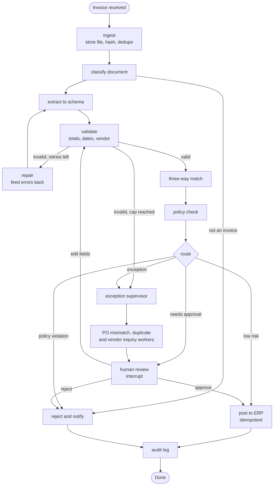
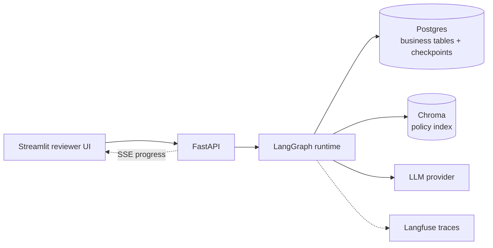

# Invoice Exception Agent

A LangGraph pipeline that extracts, validates, matches and routes supplier invoices. Clean invoices post automatically. Everything else goes to a human reviewer with the evidence attached, and the run survives a server restart while it waits.


- **Live demo:** <!-- TODO: add URL --> https://your-deployment-url
- **Demo video (2 min):** <!-- TODO: add link -->
- **Eval results:** [see below](#evaluation)

<!-- TODO: add screenshots after building


-->

## The problem

Accounts payable teams receive invoices in inconsistent formats. Before paying, each one has to be checked against the purchase order and the goods receipt. This is called a three-way match. Most invoices match cleanly. The rest have a wrong total, a duplicate, an unknown vendor, a price or quantity that disagrees with the PO, or no PO at all.

This service handles the clean ones automatically. It sends the rest to a reviewer with the extracted fields, the source document and the reason it was flagged. When it is unsure, it asks a person instead of approving.

## How it works



System components:



| Stage | Kind | What it does |
|---|---|---|
| ingest | Code | Stores the file, hashes it, checks for an exact duplicate |
| classify | LLM | Decides whether the document is an invoice |
| extract | LLM + schema | Fills a Pydantic model (vendor, PO number, lines, totals, confidence) |
| validate | Code | Checks totals, dates, currency and vendor. Reports errors, never raises |
| repair | LLM | Re-extracts with the validation errors in the prompt. Capped at 2 attempts |
| three-way match | Code (SQL) | Compares invoice lines to the PO and goods receipt |
| policy check | Code + RAG | Applies AP policy rules. Retrieval over the policy document is one tool here, not the product |
| route | Code | Picks post, review, exception or reject. Defaults to review |
| exception supervisor | LLM | Hands off to worker agents for PO mismatch, duplicates and vendor inquiry drafts |
| human review | Interrupt | Pauses the run until a reviewer approves, rejects or edits |
| post to ERP | Code | Writes to the ERP table with an idempotency key |
| audit log | Code | Runs on every exit path |

## Design decisions

- **Code validates before any LLM judges.** Whether totals add up is a deterministic question, so code answers it. Failures are reproducible.
- **The repair loop is capped at 2.** Unbounded loops cost money and hide bad extractions. After the cap, the invoice goes to the exception path.
- **The default route is review, not approve.** A wrongly approved invoice costs more than a slow review. Approval requires a clean match, a value under the configured limit and extraction confidence above the configured minimum.
- **State lives in Postgres.** The LangGraph Postgres checkpointer keeps each run under `thread_id = invoice id`, so an approval can wait days and survive a restart or redeploy.
- **The ERP post is idempotent.** On resume, the paused node runs again from its first line. A unique idempotency key makes a double post impossible.
- **The supervisor pattern is used only for exceptions.** The main path has no branch that needs an agent. Multi-agent coordination is applied where the work is open-ended, not everywhere.
- **The LLM judge scores one thing only:** the free-text explanation shown to reviewers. Everything else has ground truth and is scored by code.

## Human approval and crash recovery

When the router decides an invoice needs approval, the graph calls `interrupt()` with the evidence payload. The checkpoint is saved, a row is written to `review_task`, and the API reports the run as `pending_review`. A reviewer opens the queue in the Streamlit UI, sees the extracted fields next to the source document, and chooses approve, reject or edit. The API resumes the graph with `Command(resume=decision)` on the same thread. An edit re-runs validation before anything is posted.

To see recovery work:

```bash
# 1. Upload an invoice that needs approval (see evals/data for samples)
# 2. Wait until the UI shows it as pending review
docker compose kill api
docker compose up -d api
# 3. Approve it in the UI. The run resumes from the checkpoint and posts.
```

## Evaluation

Every synthetic invoice is generated with a known label, so each metric is computed by code against ground truth.

**Injected faults:** wrong total, duplicate invoice, unknown vendor, price mismatch against PO, quantity mismatch against receipt, missing PO, currency mismatch. Layout noise is applied on top.

| Metric | How it is measured | Gate | Latest result |
|---|---|---|---|
| Field-level extraction accuracy | Exact match per field against ground truth | 95% or more on clean layouts | TBD |
| Exception classification | Precision and recall per fault class | Recall 90% or more per class | TBD |
| Wrongly auto-approved rate | Faulty invoices that reached auto-approve | 0 on the seeded set | TBD |
| Repair loop | Fixed within the cap versus escalated | Report only | TBD |
| Trajectory checks | Required tools called, no run past the retry cap | 100% | TBD |
| Human-routing rate | Share of invoices sent to review | Report only | TBD |
| Cost and latency | Per invoice, from traces | Budget set after first run | TBD |
| Explanation quality | LLM judge with a rubric, checked against about 20 hand labels | 80% agreement | TBD |

<!-- TODO: replace TBD after the first full run. Record dataset size, model name and date beside the table. -->

The gates are starting points, tuned after the first full run. They live in `evals/thresholds.yaml`.

```bash
make eval           # runs the full set against live models
make eval-cached    # replays recorded LLM responses, used in CI
```

**Regression gate:** the GitHub Actions workflow runs the test suite and `make eval-cached`. The build fails if any metric drops below its gate.

## Tech stack

| Layer | Choice |
|---|---|
| Orchestration | LangGraph (Postgres checkpointer), LangChain for model and tool wrappers |
| Structured output | Pydantic |
| API | FastAPI with server-sent events for node progress |
| Reviewer UI | Streamlit |
| Storage | Postgres for business tables and checkpoints, Chroma for the policy index |
| Observability | Langfuse traces with cost and latency per node |
| Packaging | Docker, Docker Compose |
| CI | GitHub Actions |

## Quick start

Requirements: Docker with Compose, and an API key for your LLM provider.

```bash
git clone https://github.com/AbhigyanD/invoice-exception-agent.git
cd invoice-exception-agent
cp .env.example .env        # add your API key
docker compose up --build
make seed                   # vendors, POs, receipts, policy index
```

- Reviewer UI: http://localhost:8501
- API docs: http://localhost:8000/docs

Submit an invoice and watch progress:

```bash
curl -X POST http://localhost:8000/invoices \
  -H "X-API-Key: $API_KEY" \
  -F "file=@evals/data/invoices/<sample>.pdf"

curl -N http://localhost:8000/runs/<run_id>/stream -H "X-API-Key: $API_KEY"
```

### Configuration

| Variable | Purpose |
|---|---|
| `DATABASE_URL` | Postgres connection string |
| `ANTHROPIC_API_KEY` | Key for your LLM provider (rename to match the provider you use) |
| `LLM_MODEL` | Model used for classify, extract, repair and the supervisor |
| `API_KEY` | Key clients send in `X-API-Key` |
| `MAX_REPAIR_ATTEMPTS` | Repair loop cap. Default `2` |
| `AUTO_APPROVE_MAX_AMOUNT` | Invoices above this value always go to review |
| `MIN_CONFIDENCE` | Extraction confidence below this always goes to review |
| `LANGFUSE_PUBLIC_KEY`, `LANGFUSE_SECRET_KEY`, `LANGFUSE_HOST` | Tracing. Optional |

## API

| Method | Path | Purpose |
|---|---|---|
| `POST` | `/invoices` | Submit an invoice file and start a run |
| `GET` | `/runs/{id}/stream` | Stream node-by-node progress (SSE) |
| `GET` | `/reviews` | List pending review tasks |
| `POST` | `/reviews/{id}/decision` | Approve, reject or edit, then resume the run |
| `GET` | `/health` | Liveness check |

## Project structure

```
.
├── app/
│   ├── api/            FastAPI routes and SSE streaming
│   ├── graph/          state, nodes, routers, graph builder, supervisor subgraph
│   ├── tools/          SQL match tool, policy RAG, ERP poster
│   ├── db/             schema and seed scripts
│   └── config.py
├── ui/                 Streamlit reviewer app
├── evals/              dataset generator, metrics, runner, thresholds.yaml
├── tests/
├── .github/workflows/  CI: tests plus eval regression gate
├── docker-compose.yml
├── Dockerfile
├── Makefile
└── .env.example
```

## Testing

```bash
make test
```

Unit tests cover the validation rules, the match tool, the router and the idempotent ERP post. Graph tests run with recorded model responses so they are fast and deterministic.

## Deployment

The demo runs the same containers used locally.

1. Create a managed Postgres database (Neon works) and set `DATABASE_URL`.
2. Deploy the API from the `Dockerfile` on Render, Railway or Fly. Set the environment variables above as host secrets and point the health check at `/health`.
3. Deploy the Streamlit UI on Streamlit Cloud or the same host, pointing at the API URL.
4. Seed demo data on boot so the review queue is never empty.

CI gates deployment: a failing eval blocks the release.

## Limitations

- All data is synthetic and the ERP is a set of mock tables. Real invoice quality and a real ERP integration are not tested.
- Extraction is measured on generated layouts. Real scans are not measured.
- Approval thresholds are set from the synthetic set. Real thresholds would need real data.
- Auth is a single API key. There are no reviewer accounts or roles.
- The Streamlit UI is demo-grade.
- Single tenant, single region.

## Background

This follows [Financial-Rag](https://github.com/AbhigyanD/Financial-Rag), a RAG service I wrote stage by stage without frameworks. Here, retrieval is one tool inside a larger stateful workflow rather than the whole application.

## License

MIT. See `LICENSE`.

## Author

Abhigyan Dey. [GitHub](https://github.com/AbhigyanD)